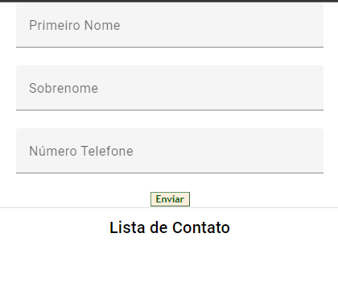
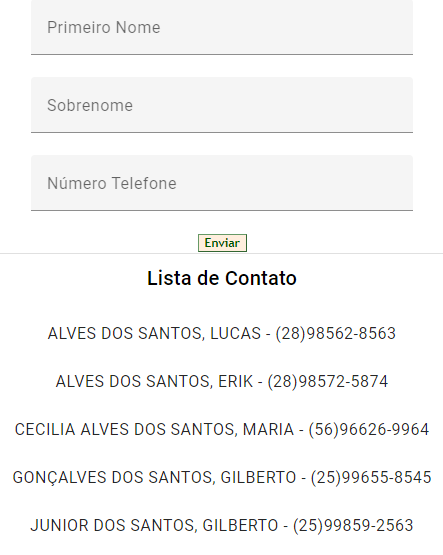

# Lista Telefonica

O objetivo da aplicação desenvolvido em `Angular2+` é incluir os dados que forem digitados no formulário e ordernar pelo `SOBRENOME`.

Neste exemplo usei o método `sort()` do javascript para fazer a ordenação dos sobrenomes dinamicamente.

Também usei o `@angular/material` colocar um visual legal nos input e na lista dee contatos.

Para instalar o material é `ng add @angular/material` e importar os modulos que deseja usar no `app.module.ts`.

```json
Angular CLI: 16.2.7
Node: 18.16.0
Package Manager: npm 9.5.1
```

## Codigo JavaScript

```javascript
// declaração e tipagem das variáveis
  firstName: string = '';
  lastName: string = '';
  phoneNumber: string = '';
  contactList: any[] = [];

// função que popula o elemento newContact
  submitForm() {
    const newContact = {
      firstName: this.firstName,
      lastName: this.lastName,
      phoneNumber: this.phoneNumber
    }
    // O método push() adiciona um ou mais elementos ao final de um array e retorna o novo comprimento desse array.
    this.contactList.push(newContact);
    // O método sort() ordena os elementos do próprio array e retorna o array.
    this.contactList.sort((a, b) => a.lastName.localeCompare(b.lastName));

  }
```
# FORMULÁRIO E LISTA VAZIA


# LISTA POPULADA E ORDENADA



<h1 align="center">💻 Desenvolvido Por: Gilberto Júnior</h1>
